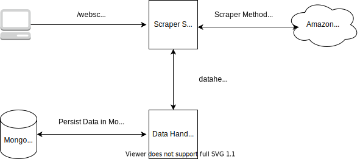

# SellerApp's Amazon Product Page Scraper Assignment

This code is the solution in response to the assignment given by SellerApp to create a Amazon product page scraper and persist the data in document store. The architecture of the application is microservice based and is containerized to run in any environment.
On running teh docker compose command, it will bring up three containers. One of the containers have the `Scraper` service which is responsible for scraping the information from Amazon product page. After extracting the info, this service utilises `DataHandler` service(which is running in another container) to push the data into document store Mongo(running in third container). Because of this design methodology, this solution is highly scalable.



# How to Use:
Navigate to the SellerApp directory and open a terminal there. Now run
`docker compose up` command. This command should spin up three containers with services `Scraper`, `DataHandler` and `Mongo`.
- **Scraper** service is exposed at **localhost : 9000**
- **DataHandler** service is exposed at **localhost : 9001**
- **Mongo** service is exposed at **localhost : 27017**

Once the containers are up, you can hit the following API endpoint in order to avail the services:
1. `/webscraper/healthcheck` (Allowed Method: GET) - This is the Healthcheck API for Scraper Service
2. `/datahelper/healthcheck` (Allowed Method: GET) - This is the Healthcheck API for DataHandler Service
3. `/webscraper/scrape_page` (Allowed Method: POST) - This is the API for scraping a page and storing the data in document store

    API Payload Structure: 
    
    ```
        Content-Type: application/json
        Payload Body: {"url": Amozon url which you want to hit (string) }
    ```

    Example Curl Request: 
    ```(JSON)
    curl --location --request POST 'localhost:9000/webscraper/scrape_page' \
    --header 'Content-Type: application/json' \
    --data-raw '{
        "url": "https://www.amazon.in/dp/B08LRFPK9W/ref=pc_mcnc_merchandised-search-11_?pf_rd_s=merchandised-search-11&pf_rd_t=Gateway&pf_rd_i=mobile&pf_rd_m=A1VBAL9TL5WCBF&pf_rd_r=AK9KFNT62EJSAYR4NK7S&pf_rd_p=28d54b6f-4a72-4f17-aeac-6575e9fcfca3"
    }'
    ```

4. `/datahelper/persist_data` (Allowed Method: POST) - This is the API for persisting the data in document store. It is called internally by Scraper service

    API Payload Structure: 
    
    ```
        Content-Type: application/json
        Payload Body: {
                    "url": Amozon url which you want to hit (string),
                    "product": {
                        "name": Name of the product (string),
                        "imageurl": URL of product image (string),
                        "description": List containing the description ([]string),
                        "price": Price (string),
                        "totalreviews": Number of reviews (integer)
                    }
        }
    ```
    
    Example Curl Request:
    ```(JSON)
    curl --location --request POST 'localhost:9001/datahelper/persist_data' \
    --header 'Content-Type: application/json' \
    --data-raw '{
        "url": "https://www.amazon.in/dp/B08LRFPK9W/ref=pc_mcnc_merchandised-search-11_?pf_rd_s=merchandised-search-11&pf_rd_t=Gateway&pf_rd_i=mobile&pf_rd_m=A1VBAL9TL5WCBF&pf_rd_r=AK9KFNT62EJSAYR4NK7S&pf_rd_p=28d54b6f-4a72-4f17-aeac-6575e9fcfca3",
        "product": {
            "name": "Samsung Galaxy S21 Plus 5G (Phantom Violet, 8GB, 128GB Storage) with No Cost EMI/Additional Exchange Offers",
            "imageurl": "https://images-eu.ssl-images-amazon.com/images/G/31/img20/Wireless/SamsungBAU/Jan2021_Newlaunch/S21_Ultra/D19895669_IN_WLME_SamsungGalaxy_S21_New_Launch_ILMs_640x45_4._CB661877906_.jpg",
            "description": [
                "Triple rear camera setup- Main Camera 12MP Dual Pixel + Ultra Wide 12MP Camera + Tele1 3X 64MP Camera | 10MP front Dual Pixel Camera",
                "(6.7-inch) Dynamic AMOLED 2X Display, FHD+ resolution with 2400 X 1080 pixels resolution, 394 PPI with 16M colours",
                "8GB RAM | 128GB internal Storage | Dual SIM (nano+nano) dual-standby (5G+5G)",
                "Android Pie v10.0 operating system with 2.9GHz Exynos 2100 octa core processor",
                "4800mAH lithium-ion battery, 1 year manufacturer warranty for device and 6 months manufacturer warranty for in-box accessories including batteries from the date of purchase"
            ],
            "price": "₹100000.00",
            "totalreviews": 16
        }
    }'
    ```

You can see the data in document store by using any mongo client. Connect to localhost: 27017 and no authentication is required.

Make sure you use the default docker settings else you need to modify the docker host information in the MONGOURI and the DATAPERSISTINGAPIURL in the DataHandler/config.json and Scraper/config.json respectively.
If you want to change any settings regarding the host or port number of the service hosted, then you can change these settings also in the congig.json file of the respective applications or in in docker-compose file.

    

  
# Tech:

[Go] - Go is an open source programming language that makes it easy to build simple, reliable, and efficient software.  
[MongoDB] - MongoDB is a document database, which means it stores data in JSON-like documents.  
[Docker Compose] - Compose is a tool for defining and running multi-container Docker applications.  

[Go]: <https://golang.org/>
[MongoDB]: <https://www.mongodb.com/>
[Docker Compose]: <https://docs.docker.com/compose/>
